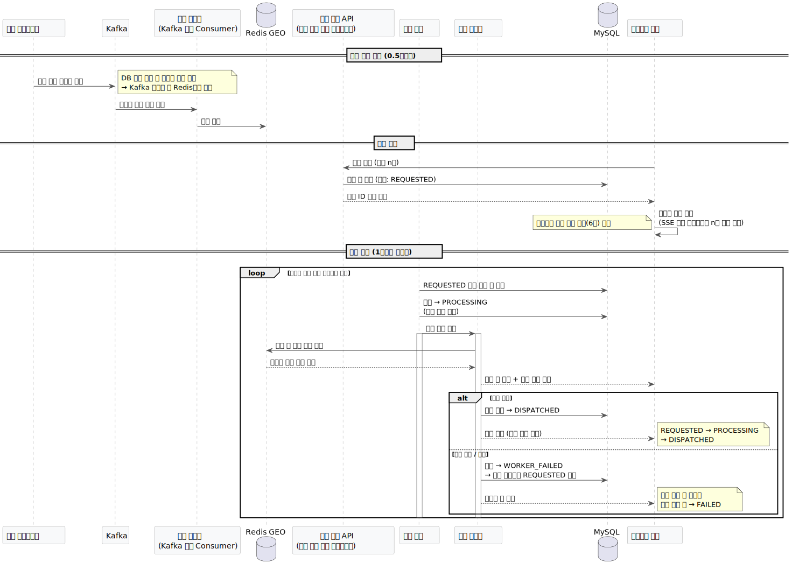
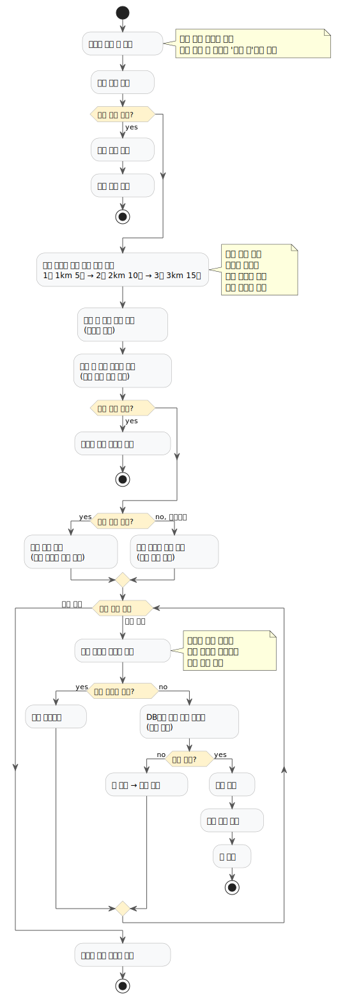
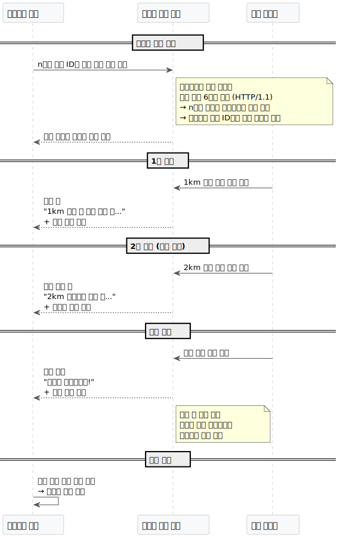

# 🚕 실시간 차량 배차 시스템

카카오택시와 같은 실시간 차량 배차 시스템을 직접 설계하고 구현한 프로젝트입니다.  
대용량 트래픽 환경에서의 **비동기 처리**, **동시성 제어**, **실시간 위치 기반 배차** 등 백엔드 핵심 기술을 실무 수준으로 구현했습니다.

---

## 기술 스택

| 구분 | 기술 |
|------|------|
| Language | Java 17 |
| Framework | Spring Boot 3.2 |
| Message Queue | Apache Kafka |
| Cache | Redis (GEO, Sorted Set) |
| Database | MySQL 8.0 |
| 인프라 | Docker, Docker Compose |
| Frontend | Next.js |

---

## 시스템 아키텍처

> 전체 흐름 — 차량 위치 수집 → 배차 요청 → 실시간 상태 푸시



---

## 핵심 설계 포인트

### 1. Redis GEO를 활용한 실시간 위치 기반 배차

초당 수백 건의 차량 위치 이벤트를 DB에 직접 저장하면 커넥션 폭발 위험이 있습니다.  
차량 위치는 **Redis GEO에만 저장**하고, `GEOSEARCH` 명령어로 반경 내 차량을 O(log N)으로 조회합니다.

또한 차량 기본 정보(`Vehicle`)와 실시간 상태(`VehicleState`)를 별도 테이블로 분리하여,  
상태 변경 시 불필요한 UPDATE가 발생하지 않도록 설계했습니다.

### 2. Kafka를 활용한 GPS 데이터 스트리밍

차량 50대가 0.5초마다 위치를 전송하면 초당 100건 이상의 이벤트가 발생합니다.  
Kafka를 버퍼로 활용하고, 파티션 키를 `vehicleId`로 설정하여 **같은 차량의 이벤트는 항상 같은 Consumer가 순서대로 처리**하도록 구성했습니다.

### 3. Redis 분산락을 활용한 동시성 제어

여러 승객이 동시에 같은 차량에 배차 요청할 경우 중복 배차 문제가 발생합니다.  
Redis `SETNX` 기반 SpinLock으로 차량별 락을 획득하고, 락 획득 후 **DB 상태를 재확인(이중 체크)**하여 동시 배차를 방지합니다.

### 4. 점진적 반경 확장 재시도 전략

주변에 차량이 없을 때 즉시 실패 처리하면 사용자 경험이 나쁩니다.  
워커 기반 재시도 + 점진적 반경 확장으로 배차 성공률을 높였습니다.

| 시도 | 반경 | 최대 차량 수 |
|------|------|-------------|
| 1차 | 1km | 5대 |
| 2차 | 2km | 10대 |
| 3차 | 3km | 15대 |
| 최종 | - | FAILED 처리 |

### 5. FSM 기반 배차 상태 관리

배차 상태를 FSM으로 관리하여 상태 전이를 명확하게 제어합니다.

```
REQUESTED → PROCESSING → DISPATCHED
                      → WORKER_FAILED → REQUESTED (재시도)
                      → FAILED (최종 실패)
```

- `PROCESSING`: 워커 처리 중 표시 → 중복 처리 방지
- `WORKER_FAILED`: 예외 발생 시 재시도 대상으로 복구
- `FAILED`: 최대 재시도 초과 시 최종 실패

> 배차 처리 흐름 상세



### 6. 서비스 등급별 배차 전략

```
NORMAL 등급  → 차량 목록 셔플 (기사 선택권 부여 효과)
BLUE / BLACK → 가장 가까운 차량 우선 (거절 불가 정책)
```

등급별 거절 가능 여부를 도메인(`VehicleGrade`)에서 직접 관리합니다.

### 7. SSE 브라우저 연결 제한 해결

HTTP/1.1 기준 브라우저의 동일 도메인 동시 연결은 6개로 제한됩니다.  
10건의 배차를 개별 SSE로 구독하면 4건이 연결되지 않는 문제가 발생합니다.  
**배차 ID 목록을 단일 스트림으로 묶어 연결**하고, 서버에서 ID별로 동일 Emitter에 매핑하는 방식으로 해결했습니다.

> SSE 구조 상세



### 8. 배차 진행 상태 실시간 시각화

배차 단계마다 SSE로 상태와 메시지를 푸시하여 진행 상황을 실시간으로 표시합니다.  
페이로드에 `nearbyVehicles`(차량번호, 등급, 거리)를 포함하여 주변 차량 목록도 함께 노출합니다.

---

## 트러블슈팅

| 문제 | 원인 | 해결 |
|------|------|------|
| Redis GEO 명령어 미지원 | 로컬 Redis 3.0 버전 | Docker로 Redis 7.0 마이그레이션 |
| `@Transactional` 미적용 | 같은 클래스 내 Self-Invocation | 별도 클래스(`RetryDispatchProcessor`)로 분리 |
| 중복 배차 | 워커가 같은 차량을 여러 승객에게 배차 | Redis 분산락 + DB 상태 이중 체크 |
| PROCESSING 상태 고착 | 워커 예외 발생 시 상태 미복구 | `WORKER_FAILED` 상태 도입 + `finally`에서 복구 |
| SSE 일부 미연결 | 브라우저 HTTP/1.1 동시 연결 6개 제한 | 배치 SSE 단일 스트림으로 전환 |